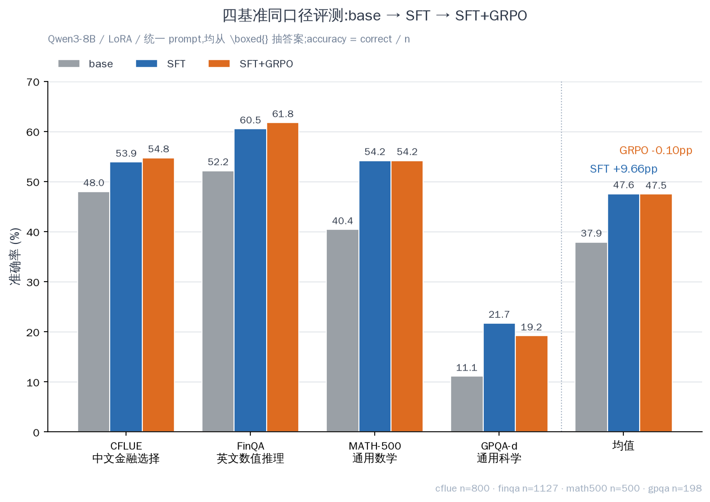
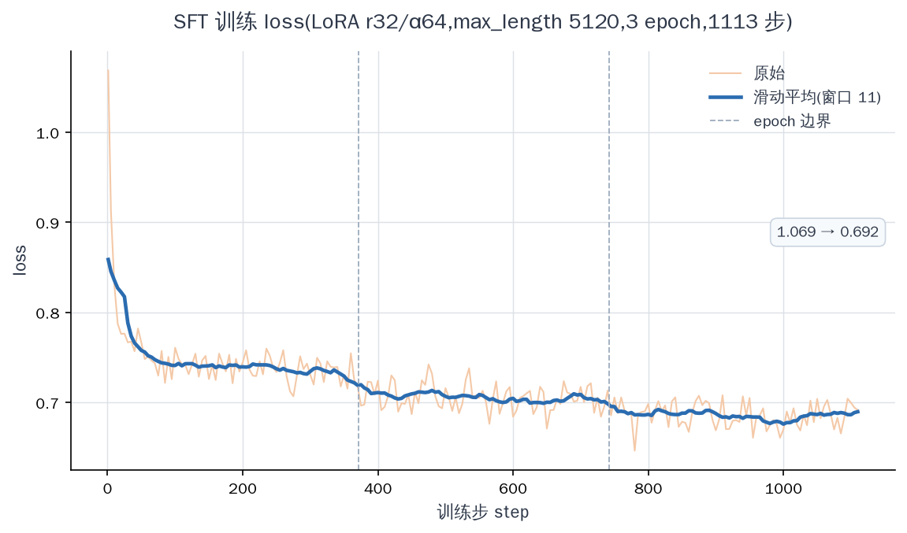
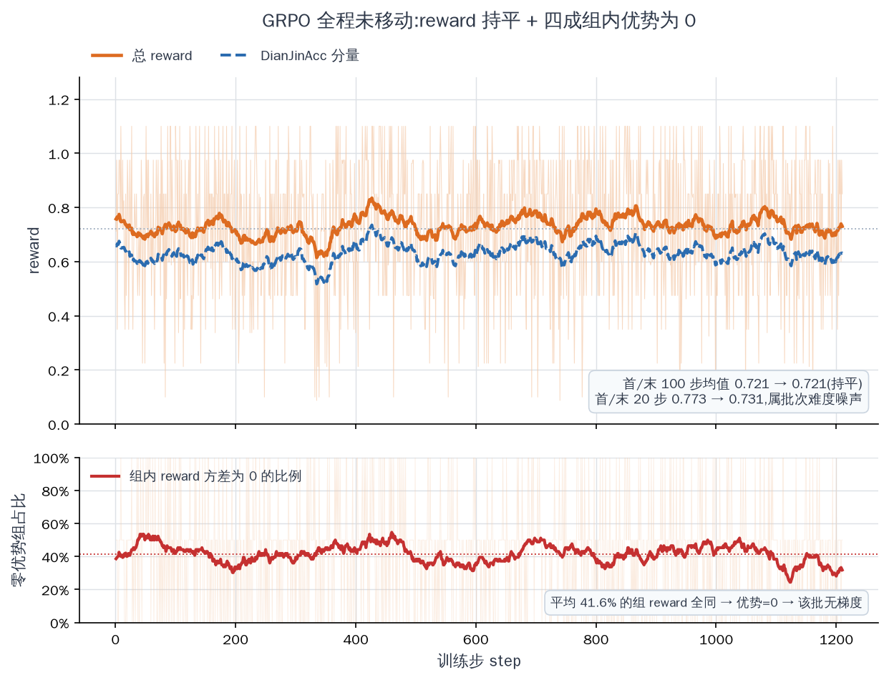
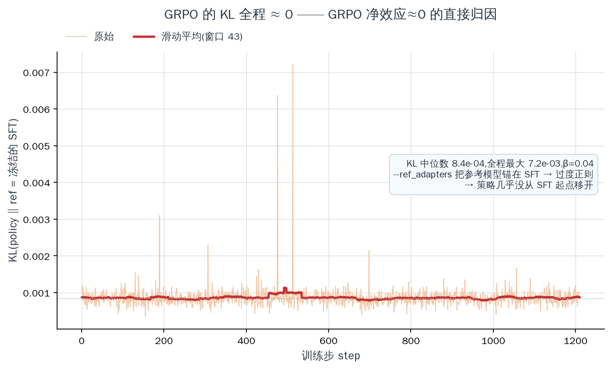
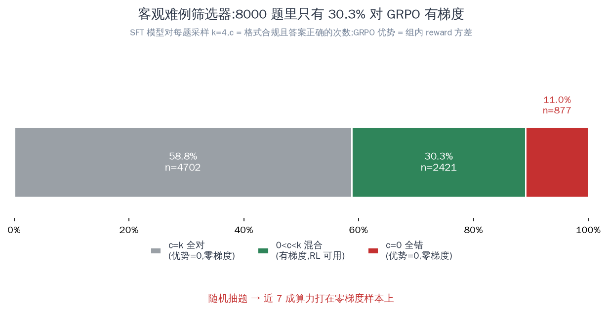
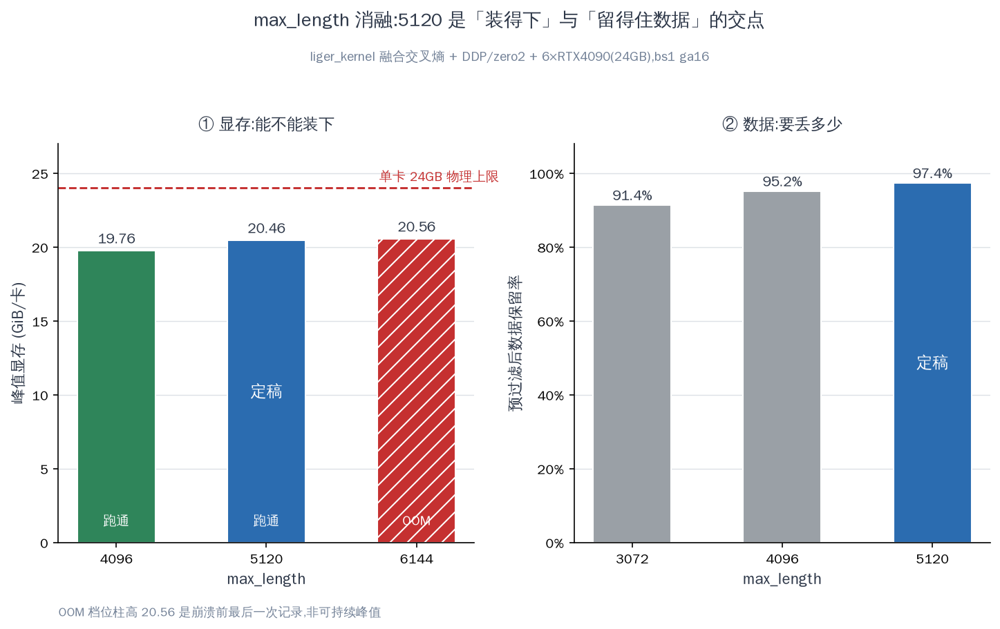
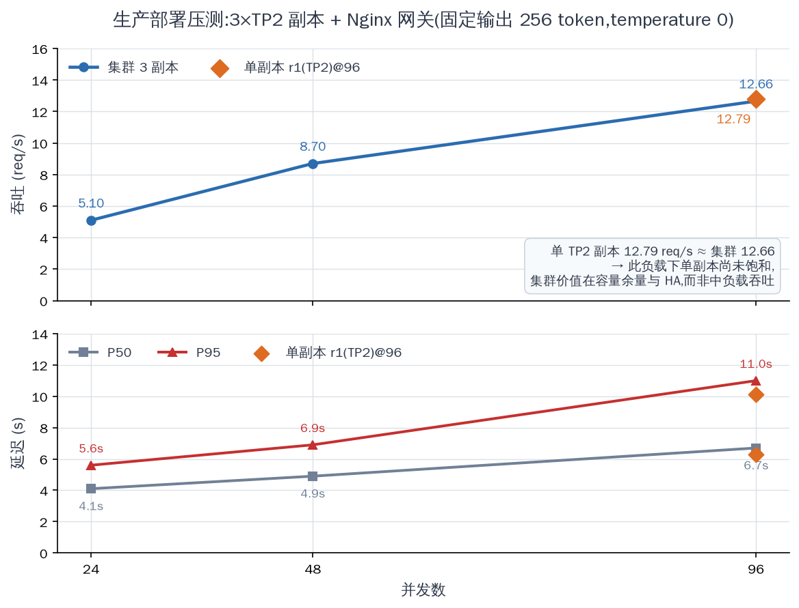
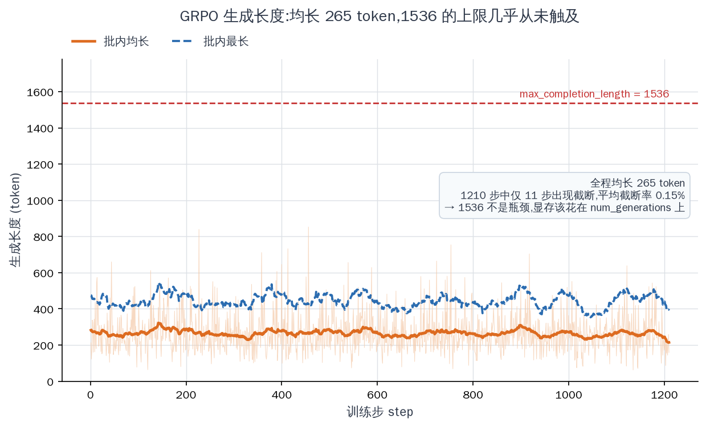

# Qwen3-8B-Fin-Posttrain

**Two-stage post-training (LoRA SFT → GRPO) of Qwen3-8B for financial reasoning, on 6×RTX4090.**
Includes the full experiment log, every evaluation artifact, and a documented **null result** for the RL stage.

---

## 项目简介

**背景。** 通用大模型在金融场景的短板不是不会算，而是"给结论不给过程"。金融是强合规领域，
一个无法审计推理链条的答案在业务上不可用。业界对此的解法是**两阶段后训练**——先用带推理链的数据
做监督微调让模型学会"先想后答"，再用可验证的规则奖励做强化学习把正确率顶上去。

**实现。** 本项目在 **6×RTX4090** 上以**纯 LoRA** 独立复现该范式，
基座 **Qwen3-8B**，框架 **ms-swift**。训练数据的题干为 CFLUE 与 FinQA 的真实金融考题
（共 36 568 条），**推理链由本项目用 DeepSeek-V4-Pro-0813 重新蒸馏**。难例筛选改用**客观判据**：
以 SFT 模型自身采样通过率 `c/k ∈ (0,1)` 为唯一条件。用 liger kernel 融合交叉熵化解 152k 大词表
LM 头的 logits 显存峰值（`max_length` 5120，数据保留率 **97.4%**），并行策略采用 DDP + ZeRO-2。
产出模型经质量门禁后以 3 副本 vLLM + Nginx 网关 + Prometheus 上线。

**结果。** SFT 在中英金融与通用推理四个基准上同口径评测**全部提升，均值 +9.66 pp**，
且通用数学与科学能力未退化反升。**GRPO 净效应约等于零**（均值 47.58 → 47.48）——
根因定位到 `--ref_adapters` 把参考模型锚在 SFT 检查点上，导致 **KL 全程 ≈ 0（中位数 8.4e-4）、
策略几乎没有离开起点**；同时 41.6% 的采样组内奖励全同，组内优势恒为 0、该批次无梯度。
这个负结果，连同全过程的"现象 → 归因 → 修复"事故日志与全部评测 artifact，一并公开在本仓库。

---

## 结果速览

统一口径：同一 prompt、从 `\boxed{}` 抽答案，accuracy = correct / n。全部有 artifact 支撑（`eval/`）。



| 基准 | n | base | SFT | SFT+GRPO | GRPO Δ |
|---|---|---|---|---|---|
| CFLUE（中文金融选择） | 800 | 48.00 | 53.87 | 54.75 | +0.88 |
| FinQA（英文数值推理） | 1127 | 52.17 | 60.51 | 61.76 | +1.24 |
| MATH-500（通用数学） | 500 | 40.40 | 54.20 | 54.20 | ±0.00 |
| GPQA-diamond（通用科学） | 198 | 11.11 | 21.72 | 19.19 | −2.53 |
| **均值** | — | **37.92** | **47.58** | **47.48** | **−0.10** |

**SFT 四基准全涨，均值 +9.66 pp**，且通用能力（MATH / GPQA）未退化反升。

**GRPO 净效应 ≈ 0。** 四个基准的 Δ 没有一个能与 0 区分开——以 GPQA 的 −2.53 pp 为例，
它等于 198 题里少答对 5 题（约 0.62σ），且两侧准确率都低于 4 选 1 随机线，不承载能力信号。

---

## 图表

英文版在 [`figures/en/`](figures/en/)，逐图数据出处见
[`figures/README.md`](figures/README.md)。

**SFT 收敛**：loss 1.069 → 0.692，图中标出 3 个 epoch 边界。



**GRPO 为什么没涨**：上图 reward 首/末 100 步 `0.721 → 0.721` 完全持平；
下图平均 **41.6%** 的采样组奖励全同 → 组内优势恒为 0 → 该批次无梯度。



**零效应的直接证据**：KL 中位数 `8.4e-4`、全程最大 `7.2e-3`（β=0.04），策略几乎没动过。



**客观难例筛选器**：8000 题中全对 58.8% / 混合 **30.3%** / 全错 11.0%——
随机抽题会把近 7 成算力打在零梯度样本上。



**max_length 消融**：①显存 4096 跑通 19.76 GB / 5120 跑通 20.46 GB / 6144 **OOM**；
②数据保留 3072 为 91.4% / 4096 为 95.2% / 5120 为 **97.4%** → 5120 是交点。



**生产压测**：并发 24/48/96 → 12.66 req/s、P95 11.0 s。单 TP2 副本 12.79 ≈ 集群 12.66，
说明此负载下副本未饱和，集群价值在容量余量与 HA。



**生成长度**：均值 265 token，1210 步中仅 11 步触发截断（0.16%）→
`max_completion_length=1536` 不是瓶颈，显存该花在 `num_generations` 上。



---

## 仓库结构

```
            SFT → 难例筛选 → GRPO → 评测 → 部署
  EXPERIMENT_LOG.md         全程实验/事故日志（每次失败的现象-归因-修复）
  REPORT-sft.md             SFT 阶段三方对比交付报告
  scripts/                  数据构建、训练编排、评测、部署门禁与压测
    distill_cot.py          推理链蒸馏（复原的参考实现）
  plugin/fin_orm.py         GRPO 双奖励插件（fin_acc + fin_format）
  eval/                     15 个评测结果 JSON（base / sft / grpo / gate 四档 + smoke）
  figures/                  16 张图表（中文 8 + en/ 英文 8）+ 逐图数据出处
  weights_archive/          4 个 LoRA checkpoint 的完整超参、trainer_state、SHA256SUMS
  deploy/                   compose + Nginx 网关 + Prometheus 配置
  data/                     自建难例 RL 集

DATA.md                     上游数据去哪取、什么许可、仓库里保留了什么
DISTILLATION.md             SFT 推理链的蒸馏方法、教师模型与参数
```

---

## 复现

```bash
pip install -r requirements.txt
```

脚本全部用环境变量取路径，没有写死任何机器路径：

| 变量 | 用途 | 谁需要 |
|---|---|---|
| `BASE_MODEL` | Qwen3-8B 基座目录 | 训练 / 评测 |
| `SFT_ADAPTER` | SFT 产出的 LoRA adapter（checkpoint-1113） | GRPO / 评测 |
| `GRPO_ADAPTER` | GRPO 产出的 adapter（checkpoint-1210） | GRPO 评测 |
| `MERGED_MODEL` | 合并后的全量模型目录 | 上线门禁 |
| `SFT_DATA_DIR` | 蒸馏产出的 SFT 数据目录 | 难例筛选 |
| `EVAL_DATA_DIR` | 评测集根目录（见 [DATA.md](DATA.md)） | 评测 |
| `REPO_ROOT` | 仓库根目录 | 可选，默认按脚本位置推断 |
| `SWIFT_BIN` · `CONDA_INIT` · `CONDA_ENV` · `RUN_DIR` | swift 可执行文件、conda 激活、运行产物落盘目录 | 可选 |

1. **准备上游依赖** —— 见 [DATA.md](DATA.md)。SFT 推理链需按 [DISTILLATION.md](DISTILLATION.md) 自行蒸馏。
2. **SFT** —— LoRA r32/α64 all-linear，lr 1e-4，3 epoch，max_length 5120 + liger 融合 CE，DDP/ZeRO-2；
   完整超参见 `weights_archive/sft-lora-checkpoint-1113-FINAL/args.json`。
3. **难例筛选** —— `scripts/build_hardcase_rl.py`：k=4 采样，只留 `0 < c/k < 1`。
4. **GRPO** —— `scripts/grpo_full.sh`，奖励插件 `plugin/fin_orm.py`；
   lr 1e-6，β=0.04，num_generations 4，max_completion_length 1536，1 epoch = 1210 步；
   完整超参见 `weights_archive/grpo-lora-checkpoint-1210-FINAL/args.json`。
5. **评测** —— `scripts/eval_fin.py` + `scripts/run_all_eval.sh`。
6. **部署** —— 合并 → `scripts/deploy_gate.sh` 质量门禁 →
   `deploy/docker-compose.yml` 起 3 副本 vLLM + Nginx 网关 + Prometheus。

---

## License

代码采用 [Apache-2.0](LICENSE)。数据与上游依赖各自的许可见 [DATA.md](DATA.md)。
