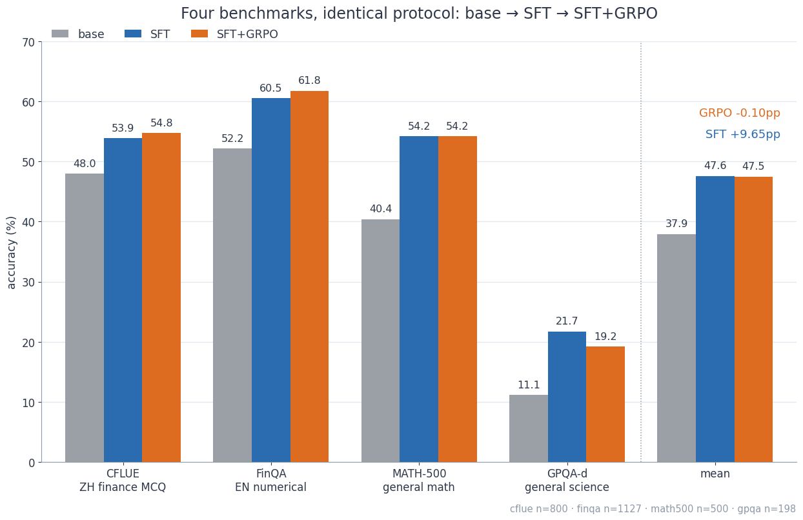
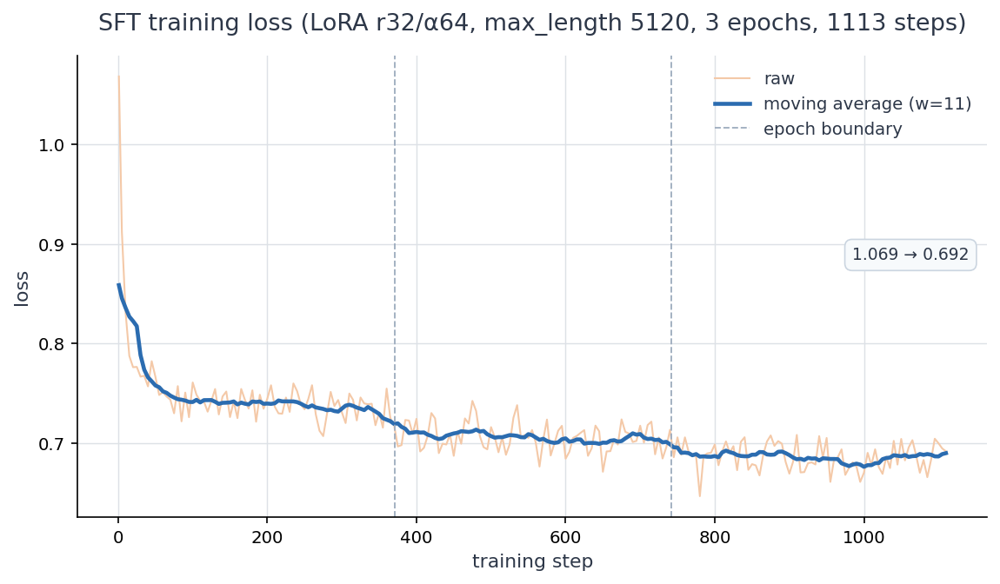
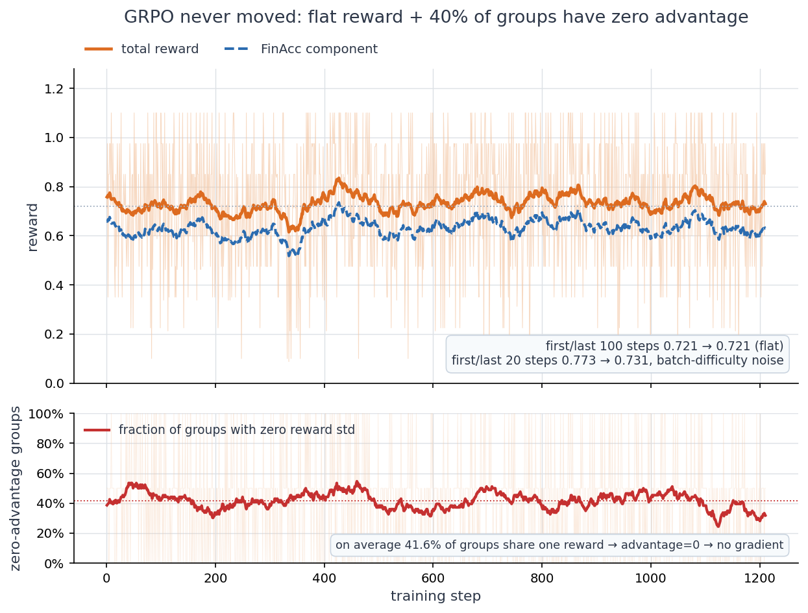
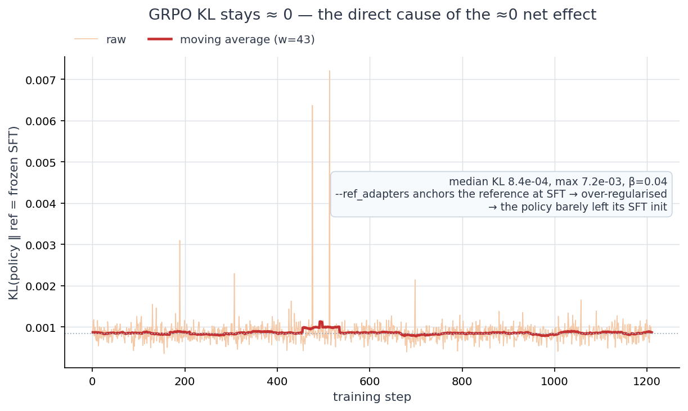
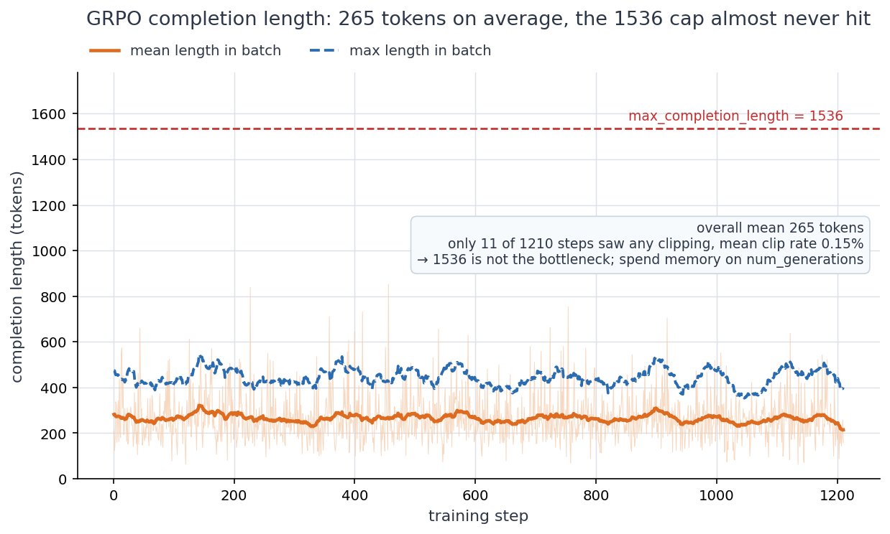
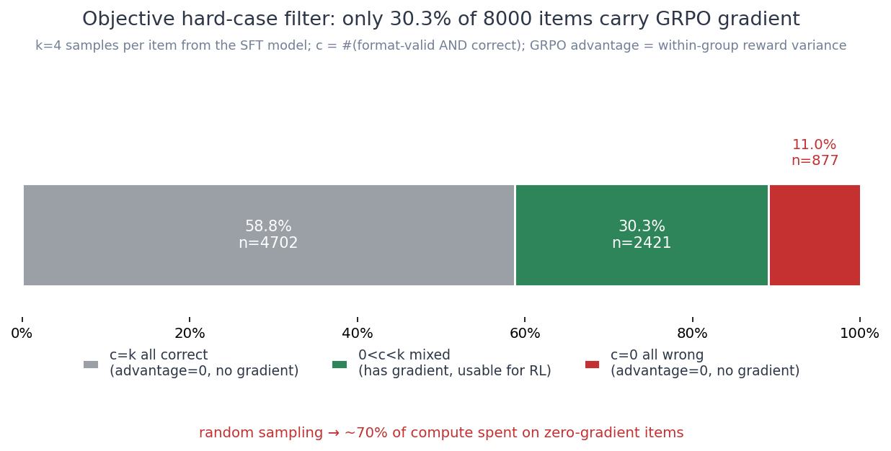
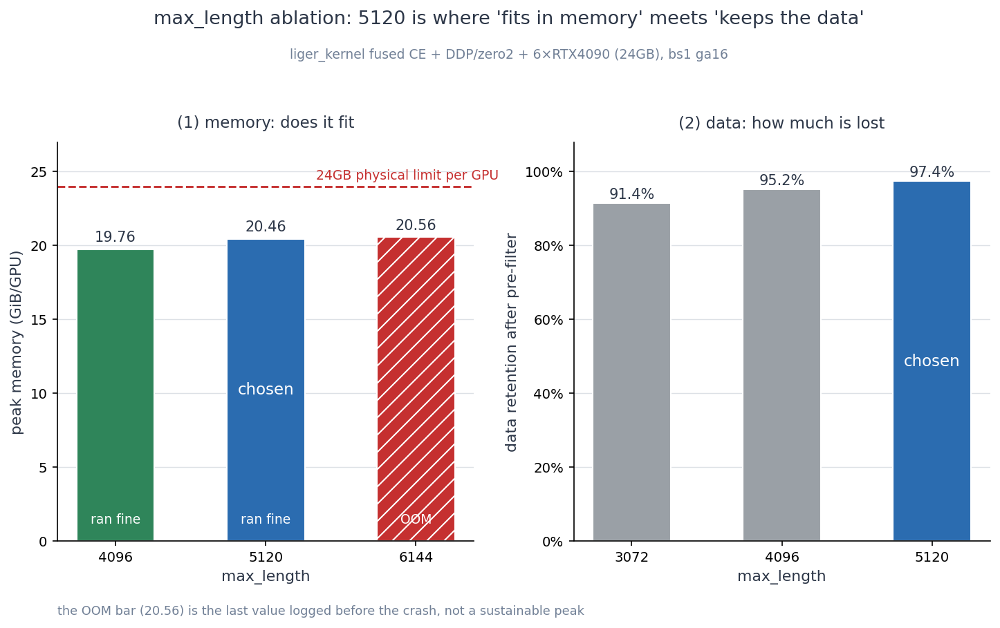
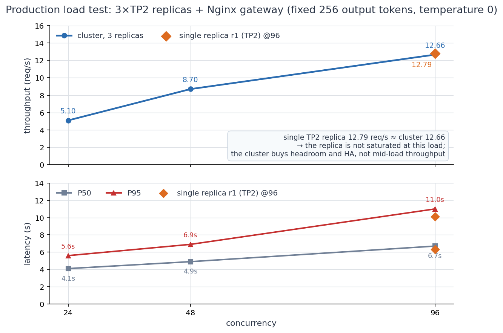

<div align="center">

# Qwen3-8B-Fin-Posttrain

**Two-stage post-training for financial reasoning · LoRA SFT → GRPO**

[](LICENSE)
[](https://huggingface.co/Qwen/Qwen3-8B)
[](https://github.com/modelscope/ms-swift)
[](#reproduction)

Full experiment log · every evaluation artifact · a documented negative result for the RL stage

[中文](README.md) · **English**

</div>

---

## Overview

Finance is a compliance-heavy domain: an answer that cannot show its reasoning is unusable in production. This project post-trains Qwen3-8B on **6×RTX4090** into a model that reasons before it answers — SFT lifts all four benchmarks, **+9.66 pp** on average; the GRPO stage that follows adds essentially nothing.

The second half is the part worth reading. That RL produced no gain traces to a single flag: `--ref_adapters` pinned the reference model to the SFT checkpoint, KL stayed ≈ 0 for the entire run, and the policy never meaningfully left where it started — and a policy that does not move leaves no reward design any room to act. The negative result is published in full, alongside a symptom → root cause → fix log that includes three entries where a later re-check found the original note wrong and corrected it in place rather than deleting it.

Every claim in this repository traces back to an evaluation artifact stored here.

#### Key design decisions

- **Base and framework** — [Qwen3-8B](https://huggingface.co/Qwen/Qwen3-8B) + [ms-swift](https://github.com/modelscope/ms-swift); both SFT and GRPO run with LoRA
- **Training data** — 36,568 real financial exam items from CFLUE and FinQA; reasoning chains distilled in-house with DeepSeek-R1
- **Hard-case selection** — an item is kept only if the SFT model's own sampling pass rate satisfies `c/k ∈ (0,1)`; no LLM judges difficulty
- **Memory bottleneck** — a liger-kernel fused cross-entropy removes the logits spike from the 152k-token vocabulary LM head, lifting `max_length` to 5120 and retaining 97.4% of the data; the final configuration is plain DDP
- **Deployment** — after a quality gate, 3 vLLM replicas behind an Nginx gateway with Prometheus

---

## Results

| Benchmark | n | base | SFT | SFT+GRPO | GRPO Δ |
|:---|---:|---:|---:|---:|---:|
| CFLUE (Chinese finance, MCQ) | 800 | 48.00 | 53.87 | **54.75** | +0.88 |
| FinQA (English numerical reasoning) | 1127 | 52.17 | 60.51 | **61.76** | +1.24 |
| MATH-500 (general math) | 500 | 40.40 | 54.20 | **54.20** | ±0.00 |
| GPQA-diamond (general science) | 198 | 11.11 | 21.72 | **19.19** | −2.53 |
| **Mean** | — | **37.92** | **47.58** | **47.48** | **−0.10** |



**SFT lifts all four benchmarks, +9.66 pp on average**, and general ability (MATH / GPQA) does not
regress.

**GRPO's net effect is ≈ 0.** None of the four deltas is distinguishable from zero. Take the −2.53 pp
on GPQA: that is five questions out of 198 (about 0.62σ), and accuracy on both sides sits below the
25% floor of a four-way multiple choice — the score carries no capability signal at that level.

---

## Figures

Chinese versions live in [`figures/`](figures/), English versions in [`figures/en/`](figures/en/).
Per-figure data provenance is documented in [`figures/README.md`](figures/README.md).

<details>
<summary><b>Training dynamics</b> — SFT convergence, why GRPO did not move, direct evidence of KL≈0, generation length</summary>

<br>

**SFT convergence**: loss 1.069 → 0.692, with the three epoch boundaries marked.



**Why GRPO did not move**: top — reward over the first and last 100 steps is flat at
`0.721 → 0.721`; bottom — on average **41.6%** of sampling groups return identical rewards, so the
in-group advantage is zero and the batch produces no gradient.



**Direct evidence of the null effect**: median KL `8.4e-4`, maximum `7.2e-3` across the whole run
(β=0.04). The policy hardly moved.



**Generation length**: 265 tokens on average; only 11 of 1210 steps hit truncation (0.16%). So
`max_completion_length=1536` is not the bottleneck — the memory is better spent on
`num_generations`.



</details>

<details>
<summary><b>Data and memory</b> — objective hard-case filter, max_length ablation</summary>

<br>

**Objective hard-case filter**: of 8,000 items, 58.8% are answered correctly every time, **30.3%**
are mixed, and 11.0% always fail. Sampling at random would spend nearly 70% of the compute on
gradient-free examples.



**max_length ablation**: (a) peak memory — 4096 runs at 19.76 GB, 5120 at 20.46 GB, 6144 **OOMs**;
(b) data retention — 91.4% at 3072, 95.2% at 4096, **97.4%** at 5120. 5120 is the crossover point.



</details>

<details>
<summary><b>Production deployment</b> — load test and what the cluster actually buys</summary>

<br>

**Load test**: at 24/48/96 concurrency the service sustains 12.66 req/s with P95 at 11.0 s. A single
TP2 replica reaches 12.79 — essentially the same as the 12.66 of the full cluster — which means the
replicas are not saturated at this load. The cluster's value here is headroom and high availability,
not throughput.



</details>

---

## Reproduction

Pipeline: **CoT distillation → SFT → hard-case selection → GRPO → evaluation → deployment**

```bash
pip install -r requirements.txt

export BASE_MODEL=/path/to/Qwen3-8B      # base model
export SFT_DATA_DIR=/path/to/sft-data    # distillation output, see DISTILLATION.md
```

| Step | Command | Key configuration |
|:---|:---|:---|
| 1 · Prepare data | see [DATA.md](DATA.md) · [DISTILLATION.md](DISTILLATION.md) | teacher DeepSeek-R1, 3 retries, GPT-4o dual-criteria verification |
| 2 · SFT | `scripts/sft.sh` | LoRA r32/α64 all-linear, lr 1e-4, 3 epochs, max_length 5120 |
| 3 · Hard-case selection | `scripts/build_hardcase_rl.py` | k=4 sampling, keep only `0 < c/k < 1` |
| 4 · GRPO | `scripts/grpo_full.sh` | lr 1e-6, β=0.04, num_generations 4, 1 epoch = 1210 steps |
| 5 · Evaluation | `scripts/run_all_eval.sh` | one shared prompt, answer extracted from `\boxed{}` |
| 6 · Deployment | `scripts/deploy_gate.sh` → `deploy/docker-compose.yml` | gate first, then 3 vLLM replicas + gateway + monitoring |

Complete hyperparameters are in each checkpoint's `args.json` under `weights_archive/`.

<details>
<summary>All environment variables</summary>

<br>

No machine path is hard-coded; every script reads its paths from the environment:

| Variable | Purpose | Needed by |
|:---|:---|:---|
| `BASE_MODEL` | Qwen3-8B base model directory | training / evaluation |
| `SFT_ADAPTER` | LoRA adapter produced by SFT (checkpoint-1113) | GRPO / evaluation |
| `GRPO_ADAPTER` | Adapter produced by GRPO (checkpoint-1210) | GRPO evaluation |
| `MERGED_MODEL` | Merged full-weight model directory | deployment gate |
| `SFT_DATA_DIR` | SFT data produced by distillation | hard-case selection |
| `EVAL_DATA_DIR` | Evaluation set root (see [DATA.md](DATA.md)) | evaluation |
| `REPO_ROOT` | Repository root | optional, inferred from script location |
| `SWIFT_BIN` · `CONDA_INIT` · `CONDA_ENV` · `RUN_DIR` | swift binary, conda activation, run output directory | optional |

</details>

---

## Repository layout

| Path | Contents |
|:---|:---|
| [`DATA.md`](DATA.md) | Data composition, where to obtain upstream resources, licensing |
| [`DISTILLATION.md`](DISTILLATION.md) | CoT distillation pipeline, teacher model, sampling parameters |
| [`EXPERIMENT_LOG.md`](EXPERIMENT_LOG.md) | Full experiment and incident log — symptom, root cause, fix |
| [`REPORT-sft.md`](REPORT-sft.md) | SFT-stage report with the three-way comparison |
| [`scripts/`](scripts/) | 11 scripts: distillation, training, hard-case selection, evaluation, deployment gate and load test |
| [`plugin/fin_orm.py`](plugin/fin_orm.py) | GRPO dual-reward plugin (`fin_acc` + `fin_format`) |
| [`eval/`](eval/) | 15 evaluation result JSONs (base / sft / grpo / gate + smoke) |
| [`figures/`](figures/) | 16 figures (8 Chinese + 8 English) with per-figure provenance |
| [`weights_archive/`](weights_archive/) | Full hyperparameters, trainer_state and SHA256SUMS for 4 LoRA checkpoints |
| [`deploy/`](deploy/) | Two docker-compose files + Nginx gateway + Prometheus config |
| [`data/`](data/) | Self-built hard-case RL set (2,421 items + a 200-item smoke subset) |

---

## License

Code is released under [Apache-2.0](LICENSE). Data and upstream dependencies carry their own
licences — see [DATA.md](DATA.md).
