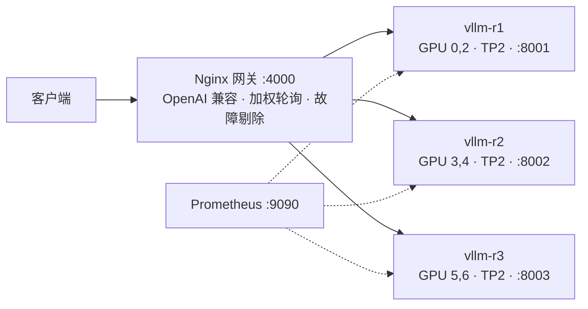

# 图表说明

全部由 `../scripts/make_figures.py` 从本交付包内的原始 artifact 生成,**没有手工产物**。
中文版在本目录,英文版在 `en/`(同名文件)。

```bash
cd phase1-sft-grpo
python3 scripts/make_figures.py              # 中文 → figures/
python3 scripts/make_figures.py --lang en    # 英文 → figures/en/
python3 scripts/make_figures.py --only 3 6   # 只重画第 3、6 张
```
依赖只有 `matplotlib`。中文版需要系统装了 CJK 字体(脚本会依次找 Noto Sans CJK SC /
Source Han Sans SC / WenQuanYi / Droid Sans Fallback);都找不到时自动降级成英文标签,不会画出方块字。

---

## 索引

| 图 | 讲什么 | 数据来源 |
|---|---|---|
| `fig1_benchmark_comparison.png` | 四基准 base→SFT→GRPO 同口径对比。SFT 均值 **+9.66pp** 且通用能力(MATH/GPQA)未退化;GRPO **-0.10pp**,噪声内等价 | `eval/eval_{bench}_{tag}.json` |
| `fig2_sft_loss.png` | SFT 收敛曲线,1.069 → 0.692,标出 3 个 epoch 边界 | `artifacts/figure_inputs.json` → `sft_loss` |
| `fig3_grpo_reward.png` | **GRPO 为什么没涨**(上)reward 首/末 100 步 0.721→0.721 完全持平;(下)平均 **41.6%** 的组 reward 全同 → 优势=0 → 该批无梯度 | `artifacts/figure_inputs.json` → `grpo` |
| `fig4_grpo_kl.png` | **核心归因**:KL 中位数 8.4e-4、全程最大 7.2e-3,β=0.04。`--ref_adapters` 把参考模型锚在 SFT → 过度正则 → 策略几乎没移开起点 | 同上 |
| `fig5_hardcase_distribution.png` | 自建客观难例筛选器:8000 题中全对 58.8% / 混合 **30.3%** / 全错 11.0%。随机抽题会把近 7 成算力打在零梯度样本上 | `artifacts/figure_inputs.json`（原 `logs/hardcase.log` 尾部汇总） |
| `fig6_maxlen_ablation.png` | max_length 消融双面板:①显存 4096 跑通 19.76 / 5120 跑通 20.46 / 6144 **OOM**;②数据保留 3072 91.4% / 4096 95.2% / 5120 **97.4%** → 5120 是交点 | `artifacts/figure_inputs.json` → `liger_runs` / `length_retention_pct` |
| `fig7_deploy_loadtest.png` | 生产压测:并发 24/48/96 → 12.66 req/s、P95 11.0s;**单 TP2 副本 12.79 ≈ 集群 12.66**,说明此负载下副本未饱和,集群价值在容量余量与 HA | `deploy/DEPLOY_LOG.md`「加演A」 |
| `fig8_completion_length.png` | 生成长度均 265 token,1210 步中仅 11 步出现截断(平均 0.16%)→ `max_completion_length=1536` 不是瓶颈,显存该花在 `num_generations` 上 | `artifacts/figure_inputs.json` → `grpo` |

## 为什么要重画

ms-swift 训练时会自动出图,但只对 `loss` / `grad_norm` /
`learning_rate` 做了平滑。GRPO 的 `reward`、`rewards/FinAcc/mean`、
`completions/*_length` 是**未平滑的逐步原始值**,1210 步画出来是一整片实心色块,
读不出任何趋势 —— 恰好这几条才是"GRPO 有没有真涨"的关键证据。另外图 1、5、6、7
这四张 ms-swift 根本不会生成。

`train_grad_norm.png`、`train_learning_rate.png`(本目录 `fig2` 是同一份数据的重绘版,
补了坐标轴标签与 epoch 边界)。

## 平滑口径

统一用**居中滑动平均**,窗口宽度写在每张图的图例里(约序列长度的 3.5%,SFT 用 5%)。
不用 EMA:EMA 在 loss 陡降段有相位滞后,会把平滑线画到原始曲线上方,看起来像"降得更慢"。
边缘按可用点收缩窗口,不做 padding。原始逐步值一律以浅色底层保留,不藏噪声。

## 部署架构(GitHub 原生渲染,不需要图片)


单副本 = Qwen3-8B bf16(~16GB 权重分 2 卡)+ ~15GB/卡 KV;TP=2 满足"整除 32 注意力头"约束(3/6 不可用)。

---

## 数据来源

全部 8 张图只依赖两处，仓库内自带，无需任何外部数据：

- `phase1-sft-grpo/artifacts/figure_inputs.json` —— 曲线与汇总数字（含 `_provenance` 字段说明逐项出处）
- `phase1-sft-grpo/eval/*.json` —— 图1 的四基准分数

原始运行记录（stdout 日志、`logging.jsonl`、tensorboard events）不随仓库发布。
